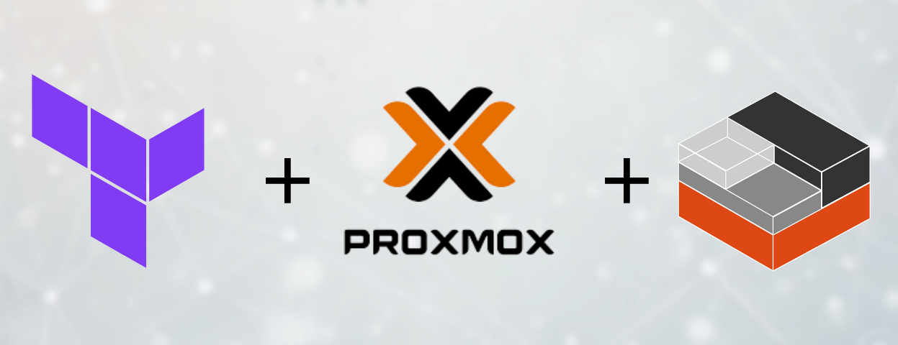

# Terraform Proxmox Module



[](https://www.terraform.io) [](https://www.proxmox.com) [](./LICENSE)

## Sumário 🌟🌟🌟

- [Visão Geral](#visão-geral)
- [Requisitos](#requisitos)
- [Como Usar](#como-usar)
- [Exemplos](#exemplos)
- [TODO](#todo)

## Visão Geral 🌍✨🚀

Este é um módulo Terraform para criar contêineres LXC no Proxmox. Ele abstrai a complexidade de configurar contêineres, permitindo que você forneça variáveis simples para implantação automatizada.

## Requisitos 📋🔧✅

- Terraform v1.x
- Acesso ao servidor Proxmox com permissões para criar contêineres LXC
- Proxmox API configurada
- Token ou credenciais de autenticação

## Como Usar 🛠️💻📦

### Passo 1: Clonar o Repositório 🌀📂⚙️

```bash
git clone https://github.com/SEU_USUARIO/seu-repositorio-terraform-proxmox.git
cd seu-repositorio-terraform-proxmox
```

### Passo 2: Configurar Variáveis ✍️📑🖊️

Edite o arquivo `terraform.tfvars` com as configurações desejadas. Exemplo:

```hcl
# Provider
pm_api_url      = "https://<ip-pve>:8006/api2/json"
pm_user         = "root@pam"
pm_password     = "<senha-pve>"
pm_tls_insecure = true

# Module
target_node    = "HomeLab" # Nome do nó Proxmox onde o container será criado
bridge         = "vmbr0"   # Interface de bridge para o LXC
ostemplate     = "local:vztmpl/ubuntu-22.04-standard_22.04-1_amd64.tar.zst"
lxc_password   = "<senha-root-container>"
storage        = "local" # Armazenamento utilizado para os discos dos containers
num_containers = 1       # Quantidade de containers a serem criados
hostname       = "lxc-terraform"
dns            = "8.8.8.8" # DNS para os containers (opcional)

# Tem valicação para essa variveis no modulo
ct_unprivileged = true # (opcional)
fuse            = true
nesting         = true

lxc_containers = {
  cores     = 2
  memory    = 1024
  swap      = 512
  disk_size = "8G"
  ip        = "dhcp" # dhcp ou estatico (ex: 192.168.1.88/24)
}

```

### Passo 3: Inicializar o Terraform 🌟🔍📈

Execute os comandos:

```bash
terraform init
terraform plan
terraform apply
```

## Exemplos 📝📖💡

Veja a pasta `examples/` para exemplos práticos de configuração do módulo com diferentes cenários.

```bash
cd examples/basic
terraform init
terraform apply
```

## TODO 📌📅🛠️

- [ ] Adicionar suporte cloud init
- [ ] Criar testes automatizados para validação do módulo

---

Feito por [João Pedro Ramos](https://github.com/joao-pedro-rdo).
